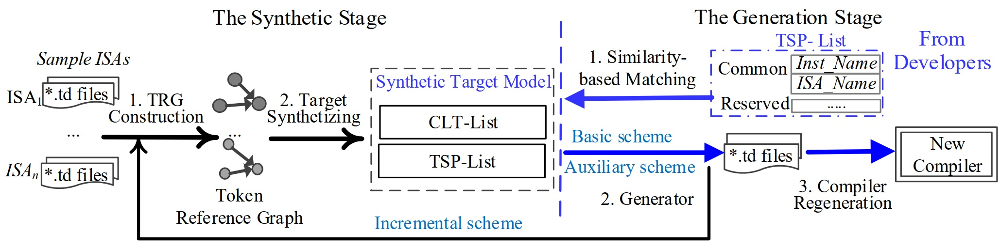
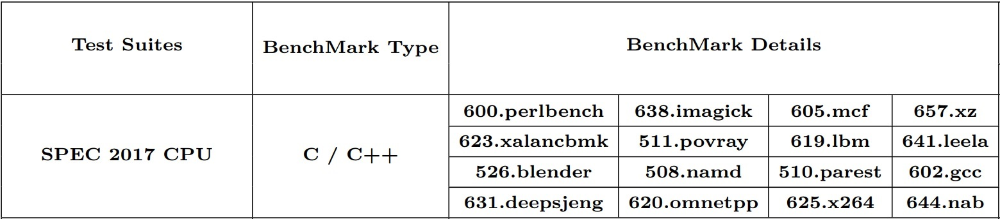

# ATG
# (Automatic Target Description File Generation)

## Introduction
We introduce a new approach, Automatic Target description file Generation(ATG), that
accelerates the generation of a compiler backend for a new target by generating its target description files automatically.
Given a new target, ATG proceeds its generation in two stages. First, ATG synthesizes a small list of target-specific properties and a
list of code-layout templates from the target description files of a set of existing targets with similar ISAs. Second, ATG
requires compiler developers to fill in the information for each instruction in the new target in the tabular form according to
the list of target-specific properties synthesized and then generates its target description files automatically according to the
list of code-layout templates synthesized. The first stage can often be reused by different new targets sharing similar ISAs.



## Prequires
- LLVM 12.0 download: [https://github.com/llvm/llvm-project/releases](https://github.com/llvm/llvm-project/releases)
- To build LLVM+Clang and use it to cross-compile for a riscv target, please refer: [https://github.com/sifive/riscv-llvm](https://github.com/sifive/riscv-llvm)
- Python 3.8+

## How to run?
### 1. Prepare llvm for compiling
To facilitate our tests for ATG, please replace those codes which can be generated by ATG from original td files. Or use [our separated version](docs/seperated_code) to replace the original RISCV backend. 

### 2. Generate code and recompile llvm with them.
```bash
# clone these project on $ATC_CODE_ROOT$, download llvm in $LLVM_ROOT$
git clone https://github.com/agilecompiler/agilecompiler.git
cd $ATC_CODE_ROOT$/atc-coding

# tuning on ideal pw and match insts based on similarity 
# Because it takes about 4 days to tune pw, we pre-trained pw in advance. In the project, 
# we directly use the result of tuning pwd and instruction matched results.

# Set the dir where you want to put the generated td files in atc-coding/gen_atg/main.py
    config_dict = {
        inst_set: {
            "out": f"$LLVM_ROOT$/llvm/lib/Target/RISCV/gen/{inst_set}_inst.td"
        } 
# Run automatic generation program to generate (td)target description files.
python atc-coding/gen_atg/main.py

# Replace the original td files with the generated td files and recompile llvm.
cd $LLVM_ROOT$ && mkdir build && cd build
cmake -G "Unix Makefiles" -DCMAKE_BUILD_TYPE="Debug" -DBUILD_SHARED_LIBS=True -DLLVM_USE_SPLIT_DWARF=True \
    -DLLVM_OPTIMIZED_TABLEGEN=True -DLLVM_BUILD_TESTS=False -DLLVM_DEFAULT_TARGET_TRIPLE="riscv64-unknown-elf" \
    -DLLVM_TARGETS_TO_BUILD="RISCV" ../llvm
 make check-llvm -j32  # set nproc as your machine
```

### 3. Validate our compiled llvm on Spec2017.



16 C/C++ benchmarks in SPEC2017 are utilized (FORTRAN cases are not included due to unavailable tool-chains on RISC-V).
These test cases are compiled by LLVM_ATG and LLVM_Original at options of “-O0 -triple=riscv32” for RV32 and
“-O0 -triple=riscv64” for RV64. The two compiler backends generated by LLVM (in more or less the same amount
of time with nearly the same code size) from both sets of *.td files emit the same assembly code for the 16 C/C++ 
benchmarks of SPEC2017.

More details in [here](docs/detail.md).

. 

